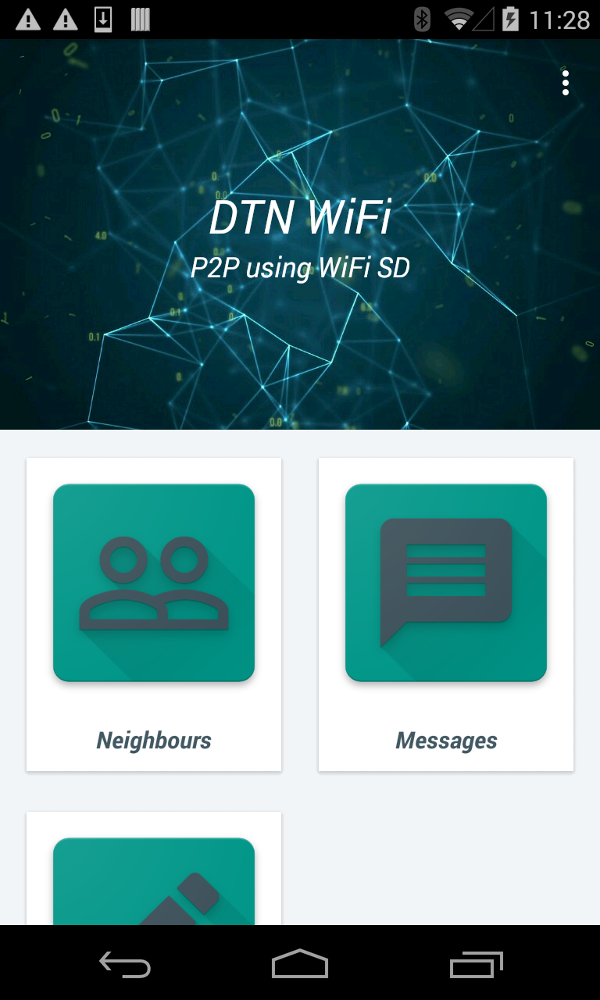
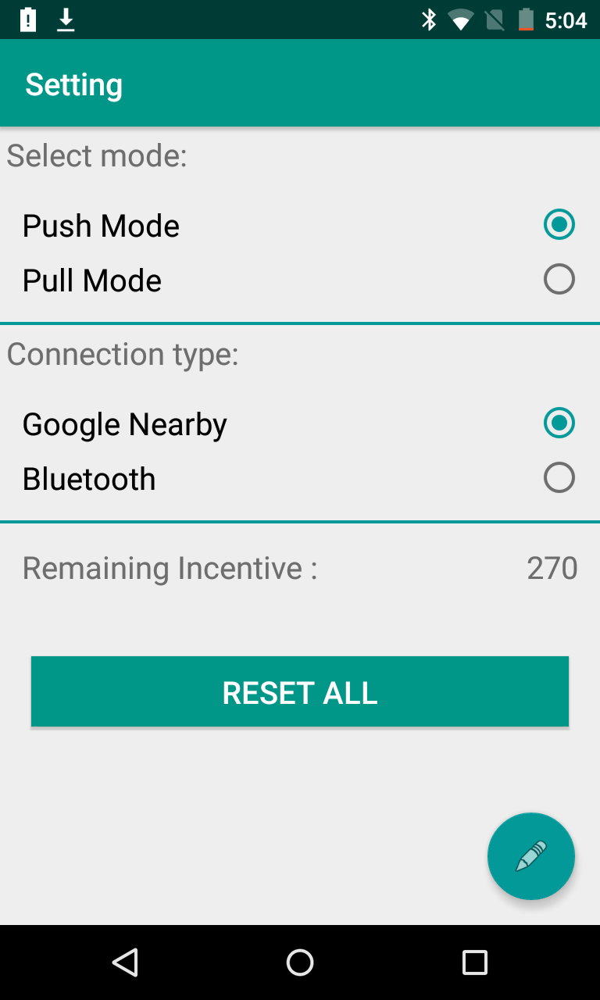

# DTN
Project to include various material design features and implement Delay Tolerant Network using Google Nearby connections API and Bluetooth. This based on IEEE paper "ChitChat: An Effective Message Delivery Method in Sparse Pocket-Switched Networks"

Homescreen, which allows users to choose actions like checking out neighbours with this app, create messages or check received messages, Modify interest (based on which they receive messages in a P2P environment)

Settings page to select the mode of transfer and connection type

